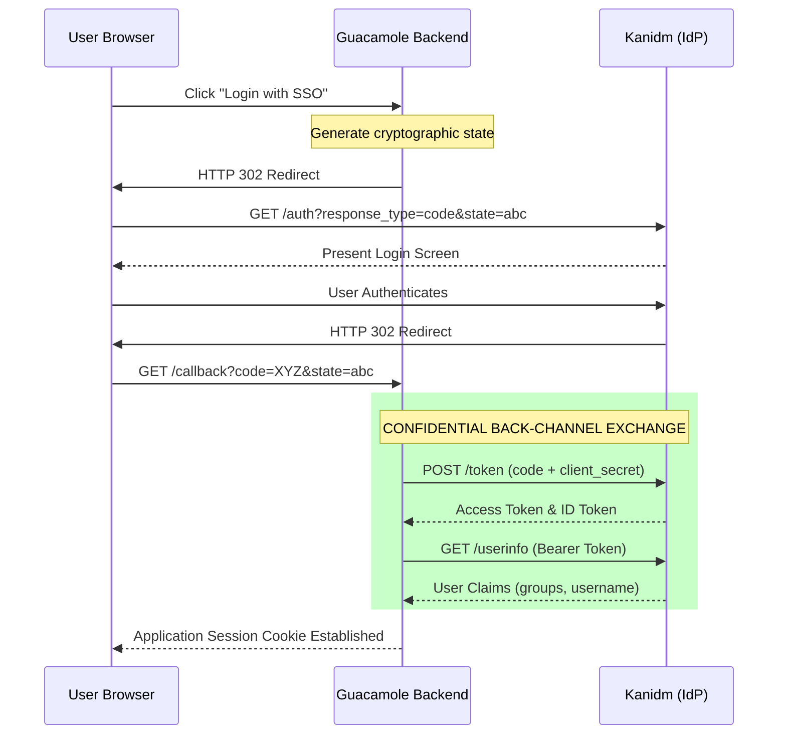
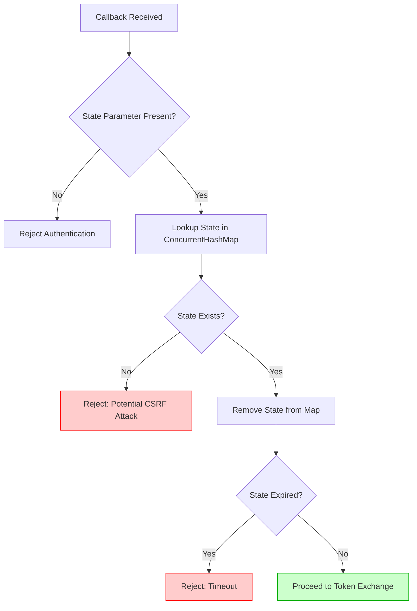

# From Filing Tickets to Fixing Problems: AI-Assisted Development of Secure OAuth2 Authentication for Apache Guacamole

**Author**: Gerry Burde
**Date**: February 2026
**Version**: 1.0

---

## Abstract

When a dependency breaks and upstream has no fix, you have two options: file a ticket and wait, or solve it yourself. AI-assisted development makes the second option viable for practitioners who understand the problem but have never worked in the language or framework involved. This paper demonstrates that approach -- from identifying a broken authentication flow to shipping a secure replacement extension, using AI to handle the implementation while the human directs the security architecture.

Our team's jump box -- Apache Guacamole -- could not authenticate against our identity provider because its built-in OpenID Connect extension hard-codes the OAuth2 implicit flow, a grant type the IETF has deprecated and modern providers increasingly reject. The only working alternative was LDAP with a separate password. We evaluated every available option -- an oauth2-proxy sidecar (abandoned based on prior experience) and a third-party extension (built for an older Guacamole version and unusable out of the box) -- before turning to AI-assisted development to fork and fix the third-party extension ourselves. During that process, we discovered a CSRF vulnerability in the original code: state validation logic existed but was never called. This paper documents the investigation, the security analysis that caught a vulnerability automated scanners would have missed, and the authorization code flow replacement with server-side token exchange and CSRF protection.

---

## 1. Background

### 1.1 OAuth2 Grant Types

The OAuth 2.0 Authorization Framework (RFC 6749) defines several grant types for obtaining access tokens. Two are relevant to browser-based applications:

**Implicit Flow** (Section 4.2): The authorization server returns the access token directly in the URL fragment (`#access_token=...`) after user authentication. The client (browser JavaScript) extracts the token from the fragment. No client secret is used, and no server-side token exchange occurs.

**Authorization Code Flow** (Section 4.1): The authorization server returns a short-lived authorization code in the URL query parameter (`?code=...`). The client's backend server exchanges this code for an access token using a confidential HTTP POST that includes the client secret. The access token never appears in the browser.

### 1.2 Why Implicit Flow Is Deprecated

The IETF's "OAuth 2.0 Security Best Current Practice" (draft-ietf-oauth-security-topics) explicitly recommends against the implicit flow for several reasons:

1. **Token exposure in URL fragments**: Access tokens in fragments are visible in browser history, referrer headers, and browser extensions
2. **No client authentication**: Without a client secret, the authorization server cannot verify that the token is being requested by the legitimate application
3. **No refresh tokens**: The implicit flow cannot issue refresh tokens, requiring re-authentication when the access token expires
4. **Fragment handling fragility**: URL fragment parsing depends on parameter ordering and encoding, which varies across identity providers

The recommended replacement is the authorization code flow, optionally with PKCE (Proof Key for Code Exchange) for public clients.

### 1.3 Apache Guacamole's Authentication Architecture

Apache Guacamole is a clientless remote desktop gateway that runs in a web browser. It provides RDP, SSH, VNC, and Telnet access through a browser-based client with no plugins or local software required. It supports pluggable authentication via Java extensions loaded from `/etc/guacamole/extensions/`. The built-in `guacamole-auth-sso` extension provides OpenID Connect authentication using the implicit flow.

### 1.4 Motivation: From Filing Tickets to Fixing Problems

This investigation began with a practical problem: Guacamole serves as our team's jump box for RDP and SSH access to internal infrastructure. Our identity provider is Kanidm, which maintains LDAP credentials separately from SSO/OAuth credentials -- they are different passwords, managed through different workflows.

The built-in Guacamole authentication options that could integrate with Kanidm were LDAP and OpenID Connect. LDAP authentication worked, but it required users to maintain and remember a separate LDAP password distinct from their SSO credentials used for every other internal service. For a jump box that every team member uses daily, this created exactly the kind of password fatigue that SSO is designed to eliminate -- users logging in with one password for Guacamole and a different one for everything else.

The built-in OpenID Connect extension should have solved this, but Kanidm rejects the implicit flow (`response_type=id_token`) entirely, returning `unsupported_response_type`. This is not a Kanidm-specific limitation -- it is the direction the industry is moving. The built-in extension's hard-coded use of a deprecated grant type meant Guacamole could not participate in our SSO infrastructure at all.

With no configuration option to switch to the authorization code flow ([GUACAMOLE-1094](https://issues.apache.org/jira/browse/GUACAMOLE-1094)), and the upstream bugs open without resolution, we evaluated every available alternative before building our own (see Section 3).

---

## 2. Vulnerability Analysis

Three upstream bugs document the deficiencies in Guacamole's built-in OpenID Connect extension:

### 2.1 [GUACAMOLE-1200](https://issues.apache.org/jira/browse/GUACAMOLE-1200): Deprecated Implicit Flow

The built-in extension hardcodes the implicit flow by requesting `response_type=id_token`. This is the OAuth2 implicit grant -- the identity provider returns the token directly in the URL fragment without a server-side exchange.

**Impact**: Modern identity providers increasingly refuse to issue tokens via implicit flow. Kanidm, certain Keycloak configurations, and some cloud identity platforms reject `response_type=id_token` entirely, returning an `unsupported_response_type` error. Organizations using these identity providers cannot integrate Guacamole with their SSO infrastructure.

**Security concern**: Even when the implicit flow succeeds, the `id_token` appears in the browser's URL fragment. This token is accessible to browser extensions, visible in browser history, and can leak through referrer headers if the page navigates to an external resource.

### 2.2 [GUACAMOLE-1094](https://issues.apache.org/jira/browse/GUACAMOLE-1094): Hard-Coded Response Type

The `response_type=id_token` value is hard-coded in the built-in extension with no configuration option to override it. This prevents administrators from switching to the authorization code flow even if their identity provider supports it.

**Impact**: AWS Cognito and Google Cloud Identity Platform reject the `id_token` response type. These providers require `response_type=code` for server-side exchange. Guacamole cannot authenticate against these widely-used identity platforms without source modification.

### 2.3 [GUACAMOLE-805](https://issues.apache.org/jira/browse/GUACAMOLE-805): URL Fragment Parsing Failures

The built-in extension's client-side JavaScript extracts the token from the URL fragment by assuming a specific parameter ordering. When an identity provider returns parameters in a different order (e.g., `#token_type=Bearer&id_token=...` instead of `#id_token=...&token_type=Bearer`), the parsing fails and the extension enters an infinite redirect loop.

**Impact**: The extension works only with identity providers that happen to return parameters in the expected order. This is not specified by any standard -- parameter ordering in URL fragments is implementation-defined.

---

## 3. Investigation

### 3.1 Confirming the Incompatibility

Kanidm's server logs confirmed the root cause directly:

```
WARN  Unsupported OAuth2 response_type (should be 'code') | event_tag_id: 2
ERROR Unable to authorise - error: unsupported_response_type
```

Guacamole 1.6.0 sends `response_type=id_token`. Kanidm only accepts `response_type=code`. No configuration change on either side can bridge this -- the built-in extension's grant type is hard-coded and the identity provider's requirement is a policy decision.

### 3.2 Evaluating Alternatives

Three options were identified:

1. **oauth2-proxy + HTTP header auth** -- Run oauth2-proxy as a reverse proxy sidecar that handles the OIDC code flow, passing the authenticated username to Guacamole's `auth-header` extension via HTTP header. This was a battle-tested approach, but we had tried oauth2-proxy for another internal service and abandoned the effort. The added infrastructure complexity -- a separate proxy container, header injection, trust boundary configuration -- was significant for what should have been a solved problem.

2. **[merterhk/guacamole-auth-sso-oauth2](https://github.com/merterhk/guacamole-auth-sso-oauth2)** -- A third-party Guacamole extension implementing the OAuth2 authorization code flow. Initially dismissed -- the project had zero stars, zero forks, five total commits, and a single release (v1.5.5). Our Guacamole installation runs version 1.6.0, and the extension was built against 1.5.5 with dependencies pinned to the older release. It could not be used as-is.

3. **SAML** -- Guacamole has a built-in SAML extension, but Kanidm only supports OAuth2/OIDC. Dead end.

With oauth2-proxy dismissed based on prior experience and the third-party extension incompatible with our Guacamole version, we had no working path to SSO. The choice was: accept LDAP with a separate password, or try to port the third-party extension to 1.6.0 ourselves.

### 3.3 Deciding to Fork

Despite its minimal community presence, the merterhk extension's source code was clean and small -- seven Java files implementing a straightforward authorization code flow. An AI-assisted source review confirmed the code was well-structured and the porting effort was feasible: update the Maven POM to target Guacamole 1.6.0 dependencies, update the manifest version, and rebuild.

This was the point where AI-assisted development became the path forward. We could not use the extension as-is, but we could fork it and make it work.

### 3.4 Discovering the CSRF Vulnerability

During the fork and porting process, the AI-assisted security review identified a vulnerability in the original extension: the `StateService` class contained an `isValid()` method for CSRF state validation, but the method was never called in the authentication callback flow. The state parameter was generated and included in the authorization redirect, but on callback, the returned state was never validated against the stored value. CSRF protection was dead code.

CSRF (Cross-Site Request Forgery) in an OAuth2 context means an attacker can craft a malicious callback URL containing the attacker's authorization code. If a victim clicks this link while authenticated, their Guacamole session becomes linked to the attacker's identity provider account -- the attacker effectively hijacks the victim's session. The `state` parameter prevents this: the server generates a random token before redirect, includes it in the authorization URL, and validates that the same token returns on callback. Without validation, the protection is meaningless.

Had we deployed the extension without inspecting the source, we would have introduced a CSRF vulnerability into our authentication infrastructure. The extension would have "worked" -- users could log in via SSO -- but the authentication flow would have been exploitable.

### 3.5 The Dependency Scanning Gap

No public CVE has been filed for the CSRF vulnerability in the original extension. No security advisory exists on the GitHub repository. Tools like Snyk, Sonatype OSS Index, and GitHub Dependabot track known CVEs in published packages -- they would not flag this extension because it has no CVE entries and is not published to Maven Central. SAST tools (like Semgrep or SonarQube) running against the source code could potentially detect dead validation code with the right rules, but these tools are rarely applied to small third-party extensions before deployment.

This is a common gap in practice: organizations deploy third-party extensions, plugins, and libraries from GitHub without security review because automated scanners report "no known vulnerabilities" -- which only means no CVE has been filed, not that the code is secure. The CSRF gap was caught because the project's agent governance rules directed the AI to look for it -- verification skills and review checklists that encode security expectations into repeatable agent behavior (see Section 7.2). The AI did not independently decide to check for dead CSRF code; the human's governance stack made it a required step. An organization that deployed the extension without directed review -- relying only on "no CVE" as a proxy for "secure" -- would have missed it entirely.

For teams deploying third-party authentication extensions: automated dependency scanning is necessary but not sufficient. Authentication code in particular -- where a logic flaw can compromise the entire authorization chain -- warrants manual or AI-assisted source review before production deployment.

### 3.6 Fork, Fix, Build

The extension was forked to [Gerry9000/guacamole-auth-sso-oauth2](https://github.com/Gerry9000/guacamole-auth-sso-oauth2). Changes:

- **CSRF state validation integrated into the authentication flow** -- the state parameter is now generated before redirect and validated on callback, with single-use enforcement and time-limited validity
- **Dependencies updated for Guacamole 1.6.0**
- **i18n resources restored** -- the login button styling and translations come from the SSO base JAR and had been dropped

The build required Docker -- there was no local Java or Maven toolchain. Guacamole extensions must be Java JARs loaded by Tomcat; there is no alternative language option. The build script extracts `guacamole-auth-sso-base` from the official Guacamole Docker image, installs it as a local Maven dependency, and builds the extension JAR with the Maven Shade plugin.

### 3.7 Deployment and Verification

Deployment is a single JAR:

1. Copy `guacamole-auth-sso-oauth2-1.6.0.jar` to `/etc/guacamole/extensions/`
2. Configure `guacamole.properties` with identity provider endpoints and client credentials
3. Restart Guacamole

After deployment, Kanidm SSO authentication worked. Team members now use the same SSO credentials for Guacamole as for every other internal service. The LDAP password is no longer needed.

---

## 4. Security Architecture of the Replacement

The replacement module implements the OAuth2 Authorization Code Flow with the following security properties:

### 4.1 Server-Side Token Exchange

The authorization code flow moves token handling to the server:



*The Authorization Code Flow, illustrating the back-channel server exchange that prevents token exposure in the browser.*

The client secret and access token never appear in the browser. The authorization code is single-use and short-lived -- the lifetime is controlled by the identity provider (Kanidm defaults to 60 seconds; other providers vary, typically 30-120 seconds). The extension itself does not enforce a code lifetime; it relies on the identity provider to reject expired codes during the exchange.

### 4.2 CSRF Protection



*The cryptographic state generation and callback validation loop required to prevent Cross-Site Request Forgery during the authentication redirect.*

The module implements CSRF protection using cryptographically random state tokens:

```java
public String generateState() {
    String state = new BigInteger(130, random).toString(32);
    StateEntry entry = new StateEntry(state, Instant.now());
    pendingStates.put(state, entry);
    return state;
}
```

Security properties of the state management:
- **Cryptographic randomness**: 130-bit tokens generated from `SecureRandom`, yielding base-32 strings with 130 bits of entropy
- **Single-use enforcement**: States are removed from the map immediately upon first validation, preventing replay attacks
- **Time-limited validity**: States expire after a configurable maximum age (default 10 minutes), with a background cleanup sweep every 60 seconds
- **Thread-safe storage**: `ConcurrentHashMap` handles concurrent requests from multiple browser sessions

**Why `SecureRandom`**: Java provides two random number generators -- `java.util.Random` and `java.security.SecureRandom`. `Random` uses a deterministic pseudorandom number generator (a linear congruential formula) that is predictable if the seed is known. `SecureRandom` draws from the operating system's entropy source (typically `/dev/urandom` on Linux) and produces cryptographically unpredictable output. For security tokens -- CSRF state, session IDs, nonces, and cryptographic keys -- `SecureRandom` is the only appropriate choice. Using `Random` or `Math.random()` for security tokens is a well-known vulnerability class that allows attackers to predict future tokens by observing past ones.

### 4.3 Token Validation and Userinfo Retrieval

After exchanging the authorization code for an access token, the module retrieves user information from the identity provider's userinfo endpoint:

```java
connection.setRequestProperty("Authorization", "Bearer " + accessToken);
```

Security properties:
- **Bearer token authentication**: Proper OAuth2 authorization header usage (not query parameter)
- **Timeout enforcement**: 10-second connect and read timeouts prevent hanging requests from blocking the authentication pipeline
- **No token logging**: Access tokens and userinfo responses are not written to Guacamole's logs, preventing credential exposure in log files
- **Response validation**: HTTP status codes are checked before parsing, with appropriate error messages for non-200 responses

### 4.4 Configuration Properties

The module exposes configuration through `guacamole.properties`:

| Property | Required | Description |
|----------|----------|-------------|
| `oauth2-authorization-endpoint` | Yes | Authorization URL |
| `oauth2-token-endpoint` | Yes | Token exchange URL |
| `oauth2-userinfo-endpoint` | Yes | Userinfo retrieval URL |
| `oauth2-client-id` | Yes | OAuth2 client identifier |
| `oauth2-client-secret` | Yes | Client secret (server-side only) |
| `oauth2-redirect-uri` | Yes | Callback URL |
| `oauth2-scope` | No | Requested scopes (default: `email profile`) |
| `oauth2-username-claim` | No | Userinfo field for username (default: `username`) |
| `oauth2-groups-claim` | No | Userinfo field for group membership (default: `groups`) |
| `oauth2-max-state-validity` | No | State token max age in minutes (default: 10) |

The client secret is stored in a server-side configuration file with restricted permissions, not in client-side code or URL parameters.

---

## 5. Comparison of Security Properties

| Property | Implicit Flow (Built-in) | Authorization Code Flow (Replacement) |
|----------|--------------------------|---------------------------------------|
| Token in browser URL | Yes (fragment) | No (server-side exchange) |
| Client secret used | No | Yes (confidential) |
| CSRF protection | None | Cryptographic state tokens |
| Refresh token support | No | Possible (IdP-dependent) |
| Token logging risk | High (URL in access logs) | Low (tokens not logged) |
| IdP compatibility | Limited (rejects id_token) | Broad (standard code flow) |
| Fragment parsing issues | Yes (order-dependent) | No (query parameter, single value) |

---

## 6. Implementation Notes

### 6.1 Build and Deployment

The module is built with Maven and packaged as a single JAR using the Maven Shade plugin, which bundles the SSO base classes required by Guacamole's extension API:

1. Extract `guacamole-auth-sso-base` from a running Guacamole installation
2. Install it to the local Maven repository
3. Build with `mvn package`
4. Copy the shaded JAR to `/etc/guacamole/extensions/`

### 6.2 Identity Provider Compatibility

The module has been tested with **Kanidm** (OAuth2/OIDC with PKCE support). It uses standard OAuth2 authorization code flow endpoints and standard userinfo claims, so it should work with any identity provider that supports the authorization code grant. The `oauth2-username-claim` and `oauth2-groups-claim` configuration properties allow mapping provider-specific claim names to Guacamole's user model.

### 6.3 Multi-Language Support

The extension includes UI translations for 9 languages (Catalan, German, English, French, Japanese, Korean, Portuguese, Russian, Chinese), matching the localization coverage of the built-in extension.

---

## 7. Methodology

### 7.1 AI-Assisted Development

The [companion paper on RDP authentication forensics](https://github.com/Gerry9000/white-papers/tree/main/rdp-auth-forensics-and-ai-patching) documents what happens when AI-generated analysis is wrong -- fabricated identifiers, incorrect claims about source code, and unnecessary patches that required adversarial verification to identify and remove. This investigation demonstrates the complementary case.

The problem was well-defined: a specific error message (`unsupported_response_type`), a known standard (OAuth2 authorization code flow), and existing code to build from. When the problem is clear and the target specification is known, AI-assisted development can proceed without the fabrication risk that ambiguous problems create. The development proceeded cleanly -- no fabricated claims, no incorrect analysis, no unnecessary changes.

### 7.2 Directing the AI

The AI handled the implementation mechanics: the Guacamole extension API, Maven Shade packaging, OAuth2 token exchange HTTP calls, CSRF state management, multi-language UI translations, and the Docker-based build scripting. The human directed the security architecture: which grant type to use, what CSRF properties to require, how to handle the client secret, what timeout values to set, and what not to log.

This division works because security decisions do not require language-specific expertise. You do not need to know Java to know that CSRF protection requires cryptographic randomness and single-use enforcement, that client secrets must never reach the browser, or that tokens should not appear in log files. The human brings security judgment; the AI brings implementation capability.

In practice, directing the AI means maintaining governance documents and skills that encode these security expectations. A project-level `CLAUDE.md` file that requires the AI to grep before referencing any identifier, classify findings as VERIFIED or INFERRED, and justify every line in a diff prevents the most common classes of AI error. Skills like `/verify-claim` (verify a technical assertion against source code before including it in any document) and `/review-diff` (adversarial review of a patch before submission) encode the verification workflow as repeatable commands. These are not Guacamole-specific -- they apply to any AI-assisted security work. The AI does not inherently know to check for dead CSRF code; the human's security review checklist and the project's verification rules direct it to look.

### 7.3 From Filing Tickets to Fixing Problems

The three GUACAMOLE bugs referenced in Section 2 have been open without resolution -- GUACAMOLE-805 since 2018, GUACAMOLE-1094 since 2019, GUACAMOLE-1200 since 2020. For the RDP bug documented in the companion paper, related issues had been open across multiple distributions for three years. The traditional path -- file an issue and wait -- had a multi-year track record of not producing results.

AI-assisted development changes this calculus. A system administrator, DevSecOps engineer, SRE, or security analyst who understands the problem, can evaluate the security implications, and can direct the architecture can now produce a working fix -- even in a language and framework they have never worked in. The extension we built is deployed in production and authenticates against a real identity provider. The alternative was continuing to use LDAP with a separate password, or waiting for upstream.

This is not limited to senior security professionals. Anyone who can identify a problem, evaluate alternatives, and apply a security review checklist can direct AI-assisted development. The tools lower the barrier from "must be able to write Java" to "must be able to evaluate whether the Java the AI wrote is secure." That is a fundamentally different -- and much broader -- set of practitioners.

---

## 8. Conclusion

The implicit flow in Guacamole's built-in OpenID Connect extension is a liability: it is deprecated by the IETF, incompatible with modern identity providers, exposes tokens in browser URLs, and relies on fragile client-side fragment parsing. The authorization code flow replacement addresses all of these issues while adding CSRF protection and proper server-side credential handling.

For organizations deploying Guacamole as a remote access gateway -- particularly in environments subject to compliance requirements (NIST 800-63B, SOC 2, HIPAA) -- migrating from implicit to authorization code flow eliminates a known category of token exposure risk. The extension is available at [Gerry9000/guacamole-auth-sso-oauth2](https://github.com/Gerry9000/guacamole-auth-sso-oauth2).

---

## Glossary

**Authorization Code Flow**: An OAuth2 grant type where the identity provider returns a short-lived authorization code to the browser, which the application's backend server then exchanges for an access token via a confidential HTTP request. The access token never reaches the browser. This is the IETF-recommended flow for server-side applications.

**Bearer Token**: An access token that grants access to a protected resource simply by presenting it -- no additional proof of identity is required. Bearer tokens are typically sent in the HTTP `Authorization` header (`Authorization: Bearer <token>`). Because possession alone grants access, bearer tokens must be protected in transit (TLS) and at rest (server-side storage only).

**Client Secret**: A confidential credential shared between the application and the identity provider. Used during the authorization code exchange to prove the application's identity. Must be stored server-side with restricted file permissions -- never in client-side code, URL parameters, or browser-accessible storage.

**CSRF (Cross-Site Request Forgery)**: An attack where a malicious site tricks a user's browser into making unwanted requests to a site where the user is authenticated. In the OAuth2 context, a CSRF attack can inject the attacker's authorization code into the victim's authentication flow, linking the attacker's identity to the victim's session. Prevented by including a cryptographically random `state` parameter in the authorization request and validating it on callback.

**Identity Provider (IdP)**: A service that authenticates users and issues tokens or assertions about their identity. Examples include Kanidm, Keycloak, AWS Cognito, Azure AD/Entra ID, and Okta. In OAuth2, the IdP is the authorization server that issues access tokens.

**Implicit Flow**: An OAuth2 grant type where the identity provider returns the access token directly in the URL fragment (`#access_token=...`). Deprecated by the IETF due to token exposure in browser history, referrer headers, and browser extensions, and the inability to use client secrets or issue refresh tokens.

**OAuth2 (Open Authorization 2.0)**: An authorization framework (RFC 6749) that enables applications to obtain limited access to user accounts on third-party services. OAuth2 defines multiple grant types (authorization code, implicit, client credentials, etc.) for different use cases. It is the foundation for most modern SSO implementations.

**OIDC (OpenID Connect)**: An identity layer built on top of OAuth2 that adds user authentication. While OAuth2 provides authorization (access to resources), OIDC adds authentication (verifying who the user is) by defining an ID token and a standard userinfo endpoint.

**PKCE (Proof Key for Code Exchange)**: An extension to the authorization code flow (RFC 7636) that protects against authorization code interception attacks. The client generates a random code verifier and sends a hashed version (code challenge) with the authorization request. During the code exchange, the client sends the original verifier, and the server validates the hash. Originally designed for mobile apps, now recommended for all public clients.

**SecureRandom**: Java's cryptographic random number generator (`java.security.SecureRandom`). Unlike `java.util.Random`, which uses a predictable pseudorandom algorithm, `SecureRandom` draws from the operating system's entropy source and produces cryptographically unpredictable output. Required for generating security tokens, session IDs, and cryptographic keys.

**State Token**: A cryptographically random value included in an OAuth2 authorization request and validated on callback. Prevents CSRF attacks by ensuring the callback corresponds to a request initiated by the legitimate application. Must be single-use (consumed after validation), time-limited, and generated with a cryptographic random number generator.

---

## References

1. IETF, "The OAuth 2.0 Authorization Framework," RFC 6749
2. IETF, "OAuth 2.0 Security Best Current Practice," draft-ietf-oauth-security-topics
3. IETF, "Proof Key for Code Exchange by OAuth Public Clients," RFC 7636
4. NIST, "Digital Identity Guidelines -- Authentication and Lifecycle Management," SP 800-63B
5. Apache Guacamole, "guacamole-auth-sso," https://github.com/apache/guacamole-client
6. GUACAMOLE-1200, "Support OAuth2 Authorization Code Flow," https://issues.apache.org/jira/browse/GUACAMOLE-1200
7. GUACAMOLE-1094, "OpenID response_type should be configurable," https://issues.apache.org/jira/browse/GUACAMOLE-1094
8. GUACAMOLE-805, "OpenID authentication broken with some providers," https://issues.apache.org/jira/browse/GUACAMOLE-805
9. merterhk, "guacamole-auth-sso-oauth2" (original), https://github.com/merterhk/guacamole-auth-sso-oauth2
10. Gerry9000, "guacamole-auth-sso-oauth2" (fork), https://github.com/Gerry9000/guacamole-auth-sso-oauth2
